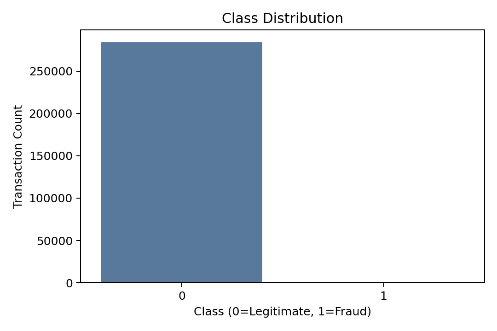
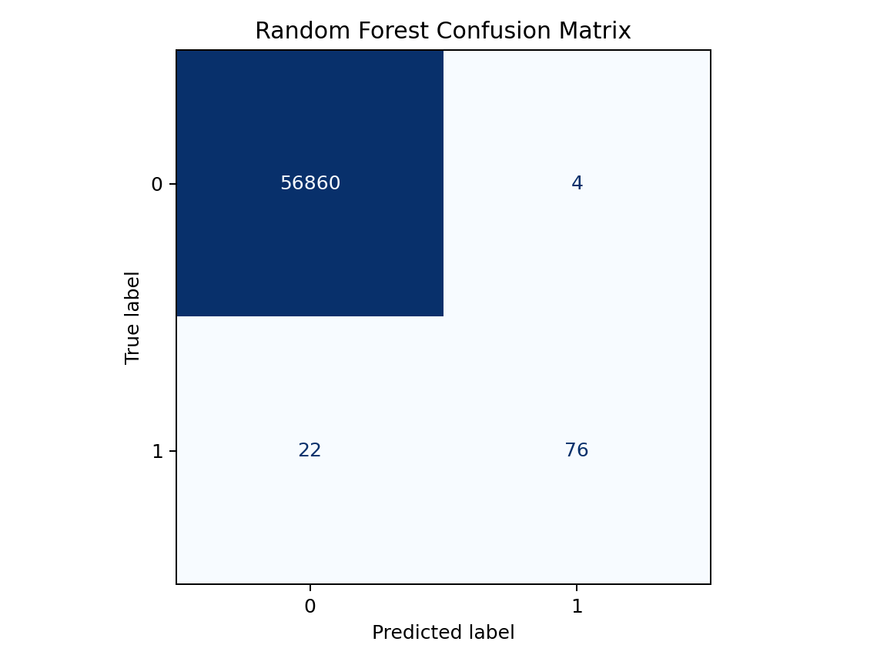
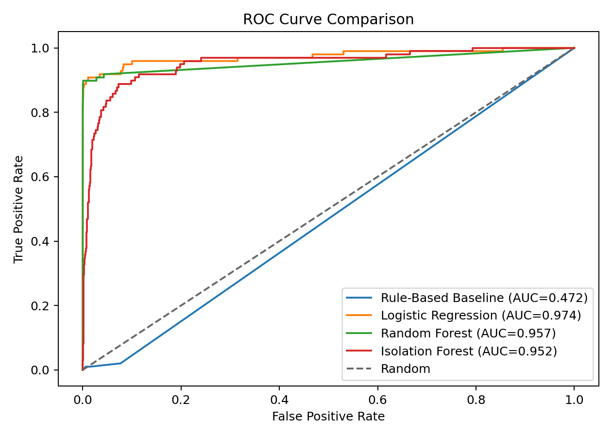
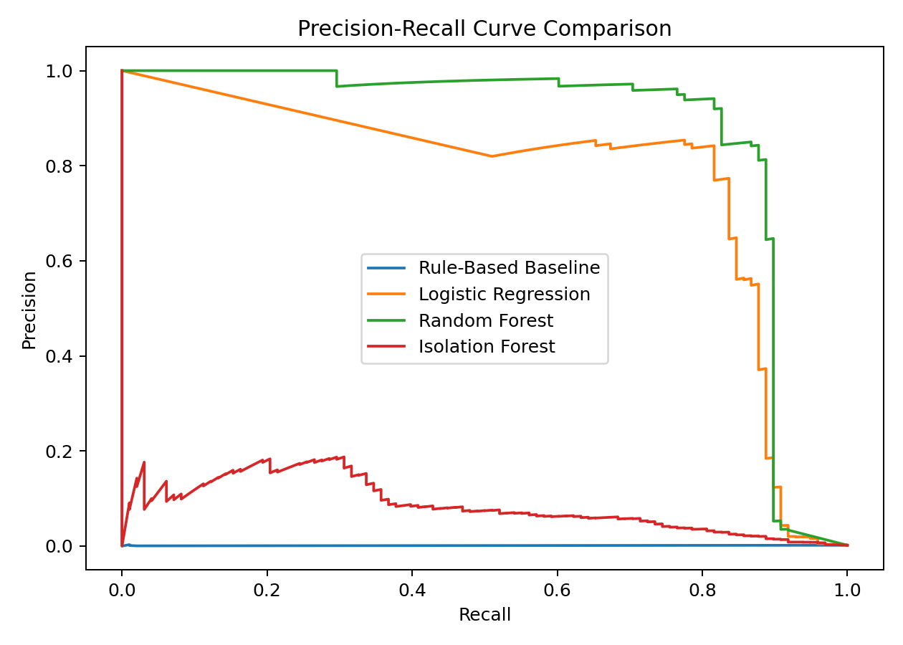

# Finansal Anomali Tespiti: Kural Tabanlı Sistemler ile Makine Öğrenmesi Modellerinin Karşılaştırılması

**Öğrenci:** Alper Özarslan  
**Öğrenci Numarası:** 0414230022  
**Ders:** Yapay Zeka Dersi Araştırma Ödevi  
**Final formatı:** IEEE LaTeX/PDF

## 1. Giriş

Finansal sistemlerde sahtekarlık tespiti, bankalar, ödeme kuruluşları ve kart sahipleri için hem ekonomik hem de güvenlik odaklı kritik bir problemdir. Kredi kartı işlemleri yüksek hacimli, hızlı ve çoğu zaman gerçek zamanlı karar gerektiren yapılardır. Bu nedenle sahtekarlık tespit sistemleri yalnızca doğru tahmin üretmekle kalmamalı, aynı zamanda düşük gecikmeyle çalışmalı, değişen saldırı davranışlarına uyum sağlayabilmeli ve operasyonel ekiplerin yorumlayabileceği çıktılar üretmelidir.

Bu çalışmanın araştırma sorusu şudur: Kredi kartı sahtekarlık tespitinde makine öğrenmesi tabanlı anomali tespit modelleri, geleneksel kural tabanlı sistemlere kıyasla doğruluk, duyarlılık ve uyarlanabilirlik açısından hangi ölçülebilir avantajlar sunar?

Çalışmanın kapsamı iki katmandan oluşmaktadır. İlk katmanda, kamuya açık kredi kartı sahtekarlık veri seti üzerinde kural tabanlı bir baseline ile Logistic Regression, Random Forest ve Isolation Forest modelleri karşılaştırılır. İkinci katmanda, gerçek zamanlı kullanım senaryosunu göstermek için Kafka ve Flink tabanlı akış mimarisi tasarlanır. Kafka işlem olaylarını taşırken, Flink pencereleme ve durum yönetimiyle kısa zaman aralığındaki işlem yoğunluğu, toplam tutar ve yüksek tutarlı işlem sayısı gibi akış özelliklerini üretir.

Bu yaklaşımın beklenen katkısı, finansal sahtekarlık tespitinde yalnızca yüksek accuracy değerlerine bakmanın neden yetersiz olduğunu göstermektir. Sahtekarlık sınıfı veri setinde çok az görüldüğü için model değerlendirmesi precision, recall, F1-score, ROC-AUC ve özellikle PR-AUC üzerinden yapılmalıdır. Bu nedenle çalışmada başarı ölçütü, kaç işlemin doğru sınıflandırıldığı kadar, sahte işlemlerin ne kadarının yakalanabildiği ve yanlış alarm maliyetinin ne düzeyde kaldığı üzerinden tartışılır.

Problem aynı zamanda üretim ortamı açısından da önemlidir. Bir bankacılık sisteminde modelin iyi skor üretmesi tek başına yeterli değildir; kararın milisaniye düzeyinde alınması, alarmın izlenebilir olması ve modelin zamanla değişen müşteri davranışlarına göre yeniden eğitilebilmesi gerekir. Bu nedenle çalışma, akademik model karşılaştırmasını çalışan bir yazılım pipeline'ı ile birleştirir.

## 2. Literatür Taraması

Chandola, Banerjee ve Kumar (2009), anomali tespiti alanındaki temel yöntemleri istatistiksel, yakınlık tabanlı, sınıflandırma tabanlı ve kümeleme tabanlı yaklaşımlar altında sınıflandırır. Çalışmanın güçlü yönü, anomali kavramını alan bağımsız biçimde açıklaması ve finans, siber güvenlik, sağlık gibi farklı uygulama alanlarına aktarılabilir bir çerçeve sunmasıdır. Bu proje açısından makale, fraud işlemlerinin normal işlem örüntüsünden sapma olarak modellenmesini teorik olarak destekler. Sınırlılığı ise modern streaming mimariler ve güncel derin öğrenme yaklaşımlarını kapsamamasıdır.

Bolton ve Hand (2002), istatistiksel fraud detection alanında erken ve etkili bir çerçeve sunar. Makale, sahtekarlık tespitinin temel zorluğunu nadir olay, dengesiz sınıf dağılımı ve değişken saldırı davranışı üzerinden açıklar. Bu çalışma açısından özellikle önemlidir çünkü kural tabanlı sistemlerin neden ilk bakışta anlaşılır olmasına rağmen yeni fraud desenlerine karşı sınırlı kalabildiğini gösterir. Bununla birlikte çalışma, bugünkü yüksek hacimli gerçek zamanlı ödeme ağları ve dağıtık akış işleme altyapılarını doğrudan ele almaz.

Phua, Lee, Smith ve Gayler (2010), veri madenciliği tabanlı fraud detection çalışmalarını kapsamlı biçimde karşılaştırır. Makale, kredi kartı, sigorta, telekom ve e-ticaret gibi farklı fraud türlerinde kullanılan yöntemlerin güçlü ve zayıf yanlarını özetler. Bu proje açısından değerli tarafı, tek bir algoritmanın her fraud senaryosunda yeterli olmadığını ve model seçiminin veri yapısı, etiket kalitesi ve operasyonel maliyetlerle birlikte değerlendirilmesi gerektiğini vurgulamasıdır. Sınırlılığı, güncel büyük veri ve stream processing pratiklerinin çalışma döneminde olgunlaşmamış olmasıdır.

Dal Pozzolo, Caelen, Johnson ve Bontempi (2015), kredi kartı sahtekarlık tespitinde dengesiz veri problemine odaklanır. Makale, undersampling gibi tekniklerin modelin olasılık kalibrasyonunu nasıl etkileyebileceğini gösterir. Bu proje için kritik nokta, eğitim setinde dengeleme yapılsa bile test setinin gerçek dağılımı koruması gerektiğidir. Aksi halde model başarısı olduğundan yüksek görünebilir. Bu nedenle çalışmada class weight yaklaşımı temel alınır, oversampling ise yalnızca train set üzerinde denenebilecek ikincil bir seçenek olarak konumlandırılır.

Happa, Bashford-Rogers, Agrafiotis, Goldsmith ve Creese (2019), Pattern-of-Life yaklaşımını anomali tespiti bağlamında ele alır. Bu yaklaşım, birey veya sistem için normal davranış örüntüsünün öğrenilmesi ve bu örüntüden sapmaların risk sinyali olarak yorumlanmasına dayanır. Finansal sahtekarlık tespitinde bu fikir, kart sahibinin olağan işlem zamanı, tutarı ve işlem sıklığı gibi davranışsal özelliklerin izlenmesiyle ilişkilidir. Çalışmanın görselleştirme odaklı olması, karar destek tarafını güçlendirir; ancak doğrudan kredi kartı veri seti üzerinde model karşılaştırması sunmaz.

Bu kaynaklar birlikte değerlendirildiğinde literatürde iki temel eğilim görülür. İlk eğilim, sahtekarlığı nadir olay ve sınıf dengesizliği problemi olarak ele alır. İkinci eğilim, davranışsal sapmayı anomali sinyali olarak yorumlar. Bu proje bu iki çizgiyi birleştirerek hem etiketli sınıflandırma modellerini hem de anomali tespit yaklaşımını aynı test dağılımında karşılaştırır.

## 3. Teorik Çerçeve

Kural tabanlı sistemler, önceden tanımlanmış eşik ve mantıksal koşullarla çalışır. Örneğin işlem tutarının belirli bir yüzdelik dilimin üzerinde olması, kısa zaman aralığında çok sayıda işlem yapılması veya normal işlem saatlerinin dışında anormal hareket görülmesi risk sinyali olarak tanımlanabilir. Bu sistemlerin en güçlü yönü yorumlanabilirliktir. Operasyon ekibi hangi kuralın alarm ürettiğini doğrudan görebilir. Ancak kurallar sabit olduğu için fraud davranışı değiştiğinde sistemin manuel güncellenmesi gerekir.

Makine öğrenmesi modelleri ise karar sınırını veriden öğrenir. Logistic Regression doğrusal ve açıklanabilir bir baseline sağlar. Random Forest doğrusal olmayan ilişkileri yakalayabilir ve değişkenler arasındaki etkileşimlerden yararlanabilir. Isolation Forest ise etiketli sınıflandırmadan farklı olarak normal gözlemlerden ayrışan örnekleri izole etme fikrine dayanır. Bu nedenle hem supervised hem de unsupervised/anomaly detection perspektifini temsil eder.

Finansal fraud detection probleminin temel zorluğu sınıf dengesizliğidir. Gerçek kredi kartı veri setlerinde fraud işlemler toplam işlemlerin çok küçük bir bölümünü oluşturur. Bu nedenle accuracy tek başına yanıltıcıdır. Örneğin tüm işlemleri "legitimate" tahmin eden bir model yüksek accuracy elde edebilir fakat hiçbir sahte işlemi yakalayamaz. Bu nedenle precision, recall, F1-score ve PR-AUC daha anlamlıdır. Recall, gerçek fraud işlemlerinin ne kadarının yakalandığını; precision ise fraud olarak işaretlenen işlemlerin ne kadarının gerçekten fraud olduğunu gösterir.

Confusion matrix bu değerlendirmeyi operasyonel maliyetle ilişkilendirir. False negative, sahte işlemin kaçırılmasıdır ve doğrudan finansal kayba yol açabilir. False positive ise meşru işlemin şüpheli sayılmasıdır ve müşteri deneyimini bozar. Bu nedenle model seçimi yalnızca en yüksek skorla değil, kurumun risk iştahı ve yanlış alarm toleransıyla birlikte yapılmalıdır.

Dengesiz veri ortamında ROC-AUC ve PR-AUC farklı bilgiler verir. ROC-AUC modelin genel ayrıştırma gücünü gösterirken, PR-AUC pozitif sınıfın çok nadir olduğu problemlerde daha hassas bir değerlendirme sağlar. Fraud detection gibi alanlarda yüksek ROC-AUC değerine rağmen precision düşük kalabilir; bu durumda model çok sayıda yanlış alarm üreterek operasyonel olarak kullanışsız hale gelebilir.

Gerçek zamanlı mimaride Kafka, işlem olaylarının güvenilir biçimde taşınmasını sağlar. Flink ise zaman pencereleri ve state yönetimi ile akan veriden özellik üretir. Örneğin beş dakikalık pencerede toplam işlem sayısı, toplam tutar ve yüksek tutarlı işlem sayısı hesaplanabilir. Bu özellikler ML modelinin anlık risk skoru üretmesi için kullanılabilir.

## 4. Metodoloji

Ana veri seti olarak Kaggle üzerinde yayımlanan Credit Card Fraud Detection veri seti kullanılmıştır. Veri seti Avrupa kart sahiplerine ait iki günlük kredi kartı işlemlerini içerir. Gizlilik nedeniyle V1-V28 arası özellikler PCA dönüşümüyle anonimleştirilmiştir. `Time`, `Amount` ve `Class` kolonları doğrudan kullanılır. `Class=1` fraud, `Class=0` legitimate işlem anlamına gelir.

Deney tekrarlanabilir olacak şekilde komut satırından çalıştırılan bir Python pipeline'ı olarak hazırlanmıştır. Veri okuma, özellik üretimi, model eğitimi, metrik hesaplama, grafik üretimi ve model kaydetme adımları ayrı modüllere ayrılmıştır. Test seti üzerinde hiçbir oversampling uygulanmaz; bu tercih gerçek dağılıma yakın değerlendirme yapılmasını sağlar.

Veri hazırlığında önce eksik değer ve sınıf dağılımı kontrol edilir. `Time` kolonundan `hour_of_day` ve `day_index` türetilir. `Amount` kolonu StandardScaler ile normalize edilir ve `Amount_scaled` özelliği eklenir. Eğitim ve test ayrımı stratified split ile yapılır; böylece fraud oranı train ve test setlerinde korunur.

Kural tabanlı baseline üç sinyal üzerinden kurulur: yüksek tutarlı işlem, tutar z-score değerinin belirli eşiği aşması ve kısa zaman aralığında yoğun işlem örüntüsü. Bu sinyallerden risk skoru üretilir ve skor eşiği aşıldığında işlem fraud olarak sınıflandırılır. Bu baseline, ML modelleriyle aynı test setinde değerlendirilir.

Makine öğrenmesi tarafında Logistic Regression, Random Forest ve Isolation Forest kullanılır. Logistic Regression açıklanabilir referans modeldir. Random Forest ana güçlü modeldir çünkü doğrusal olmayan ilişkileri ve özellik etkileşimlerini daha iyi yakalayabilir. Isolation Forest ise etiket bağımlılığı daha düşük bir anomali tespit yaklaşımı sağlar. Sınıf dengesizliği için Logistic Regression ve Random Forest modellerinde balanced class weight kullanılır.

Akış demosunda Kafka iki topic ile yapılandırılır: `transactions` ve `fraud-alerts`. Producer test verisinden satırları işlem olayı olarak yayınlar. Fraud detector bileşeni modeli belleğe alır, gelen işlem için aynı özellik hazırlama mantığını uygular ve risk sonucunu alarm topic'ine yazar. Flink job tasarımı ise pencere bazlı sayım ve tutar istatistiklerini üretecek katman olarak konumlandırılmıştır.

Değerlendirme metrikleri precision, recall, F1-score, ROC-AUC, PR-AUC ve confusion matrix olarak seçilmiştir. Grafikler sınıf dağılımı, confusion matrix, ROC curve ve precision-recall curve olarak üretilir. Kafka + Flink tarafı ise modelin üretim benzeri gerçek zamanlı akışta nasıl konumlanacağını göstermek için kullanılır.

## 5. Senaryo / Veri Analizi

Deney, Kaggle üzerinden indirilen gerçek Credit Card Fraud Detection veri setiyle çalıştırılmıştır. Veri seti 284.807 işlemden oluşmaktadır ve yalnızca 492 işlem fraud olarak etiketlenmiştir. Fraud oranının yaklaşık %0,173 olması, problemin yüksek derecede dengesiz sınıflandırma problemi olduğunu göstermektedir. Bu nedenle model başarısı accuracy ile değil, precision, recall, F1-score, ROC-AUC ve PR-AUC metrikleriyle yorumlanmıştır.

Veri seti özeti:

| Ölçüt | Değer |
|---|---:|
| Toplam işlem | 284807 |
| Fraud işlem | 492 |
| Legitimate işlem | 284315 |
| Fraud oranı | 0.001727 |
| Eksik değer | 0 |

Model karşılaştırma çıktısı:

| Model | Precision | Recall | F1 | ROC-AUC | PR-AUC |
|---|---:|---:|---:|---:|---:|
| Random Forest | 0.950 | 0.776 | 0.854 | 0.957 | 0.869 |
| Logistic Regression | 0.056 | 0.908 | 0.105 | 0.974 | 0.724 |
| Isolation Forest | 0.157 | 0.163 | 0.160 | 0.952 | 0.087 |
| Rule-Based Baseline | 0.001 | 0.010 | 0.002 | 0.472 | 0.002 |

Tablo sonuçları, aynı veri setinde farklı model ailelerinin farklı operasyonel davranışlar ürettiğini göstermektedir. Logistic Regression recall açısından güçlüdür fakat yanlış alarm sayısı yüksektir. Random Forest daha az fraud yakalamasına rağmen çok daha temiz alarm listesi üretir. Isolation Forest ise etiketsiz anomali mantığını temsil ettiği için teorik açıdan değerlidir; ancak bu veri setinde fraud etiketleriyle uyumu sınırlı kalmıştır.

Sonuçlar, kural tabanlı baseline'ın gerçek veri setinde yetersiz kaldığını göstermektedir. Baseline yalnızca 1 fraud işlemi yakalayabilmiş, 97 fraud işlemi kaçırmıştır. Bu sonuç, yalnızca tutar eşiği ve basit zaman yoğunluğu sinyallerinin PCA ile anonimleştirilmiş kredi kartı veri setinde güçlü ayrıştırma sağlayamadığını gösterir.

Random Forest modeli en dengeli sonucu üretmiştir. Test setinde 76 fraud işlemi doğru yakalamış, yalnızca 4 meşru işlemi yanlış alarm olarak işaretlemiştir. Precision değerinin 0,95 olması, operasyonel ekip açısından alarm kalitesinin yüksek olduğunu gösterir. Recall değerinin 0,776 olması ise bazı fraud işlemlerinin kaçırıldığını, fakat kural tabanlı baseline'a göre çok daha güçlü yakalama kapasitesi sağlandığını gösterir.

Logistic Regression modeli 89 fraud işlemi yakalayarak en yüksek recall değerine ulaşmıştır; ancak 1513 false positive üretmiştir. Bu sonuç, modelin sahtekarlığı kaçırmama açısından agresif davrandığını fakat operasyonel alarm yükünü ciddi biçimde artırdığını gösterir. Bu nedenle Logistic Regression risk toleransı yüksek, manuel inceleme kapasitesi geniş senaryolarda tercih edilebilirken, Random Forest daha dengeli üretim seçeneği olarak öne çıkar.

Isolation Forest, unsupervised anomali tespiti perspektifini temsil etmesine rağmen fraud sınıfını yakalamada sınırlı kalmıştır. PR-AUC değerinin düşük olması, dengesiz veri setlerinde yalnızca genel aykırılık fikrinin etiketli fraud davranışını yakalamakta yetersiz olabileceğini göstermektedir.

Üretilen görseller:

Gerçek zamanlı senaryoda işlem olayları Kafka `transactions` topic'ine yazılır. Fraud detector consumer eğitilmiş Random Forest modelini kullanarak her işlem için fraud olasılığı hesaplar ve sonucu `fraud-alerts` topic'ine gönderir. Flink katmanı ise beş dakikalık pencerelerde işlem sayısı, yüksek tutarlı işlem sayısı, toplam tutar ve ortalama tutar gibi akış özelliklerini üretmek için konumlandırılmıştır.

## 6. Sonuç ve Tartışma

Çalışma, finansal sahtekarlık tespitinde kural tabanlı sistemlerin yorumlanabilir ve hızlı kurulabilir olduğunu, ancak değişen fraud davranışlarına uyumda sınırlı kaldığını göstermektedir. Makine öğrenmesi modelleri, özellikle Random Forest gibi doğrusal olmayan modeller, veri içindeki karmaşık ilişkileri öğrenerek daha yüksek yakalama oranı sağlayabilir. Bununla birlikte ML modelleri de sınıf dengesizliği, veri kayması, açıklanabilirlik ve yanlış alarm maliyeti gibi sorunlarla birlikte değerlendirilmelidir.

Bu projede başarı ölçütü accuracy yerine recall, precision, F1-score ve PR-AUC üzerinden kurulmuştur. Bu tercih kritiktir çünkü fraud sınıfı çok nadirdir ve accuracy değeri yüksek olan bir model operasyonel olarak başarısız olabilir. Özellikle false negative işlemler finansal kayıp doğurduğu için recall metriği merkezi önemdedir. False positive ise müşteri deneyimi ve operasyonel iş yükü açısından izlenmelidir.

Kafka ve Flink mimarisi, modelin yalnızca offline analiz aracı olmadığını, gerçek zamanlı ödeme sistemlerine nasıl entegre edilebileceğini gösterir. Kafka olay taşıma katmanı, Flink ise zaman pencereli özellik üretimi ve stateful stream processing katmanı olarak görev alır. Bu yapı, model skorlarını operasyonel alarm sistemlerine dönüştürmek için uygundur.

Çalışmanın temel sınırlılığı, ana kredi kartı veri setindeki V1-V28 özelliklerinin PCA ile anonimleştirilmiş olmasıdır. Bu durum model performansını ölçmeye imkan tanırken, davranışsal açıklamaları sınırlar. Gelecek çalışmalarda kullanıcı bazlı geçmiş işlem profilleri, merchant kategorileri, coğrafi konum ve cihaz bilgisi gibi açıklanabilir davranışsal özelliklerle Pattern-of-Life yaklaşımı daha güçlü uygulanabilir.

## 7. Kaynakça

[1] R. J. Bolton and D. J. Hand, "Statistical fraud detection: A review," *Statistical Science*, vol. 17, no. 3, pp. 235-255, 2002, doi: 10.1214/ss/1042727940.

[2] V. Chandola, A. Banerjee, and V. Kumar, "Anomaly detection: A survey," *ACM Computing Surveys*, vol. 41, no. 3, Article 15, 2009, doi: 10.1145/1541880.1541882.

[3] A. Dal Pozzolo, O. Caelen, R. A. Johnson, and G. Bontempi, "Calibrating probability with undersampling for unbalanced classification," in *2015 IEEE Symposium Series on Computational Intelligence*, 2015, pp. 159-166, doi: 10.1109/SSCI.2015.33.

[4] J. Happa, T. Bashford-Rogers, I. Agrafiotis, M. Goldsmith, and S. Creese, "Anomaly detection using pattern-of-life visual metaphors," *IEEE Access*, vol. 7, pp. 154018-154034, 2019, doi: 10.1109/ACCESS.2019.2948490.

[5] Machine Learning Group - ULB, "Credit Card Fraud Detection Dataset," Kaggle. [Online]. Available: https://www.kaggle.com/datasets/mlg-ulb/creditcardfraud. Accessed: Apr. 26, 2026.

[6] C. Phua, V. Lee, K. Smith, and R. Gayler, "A comprehensive survey of data mining-based fraud detection research," *arXiv preprint arXiv:1009.6119*, 2010. [Online]. Available: https://arxiv.org/abs/1009.6119.
